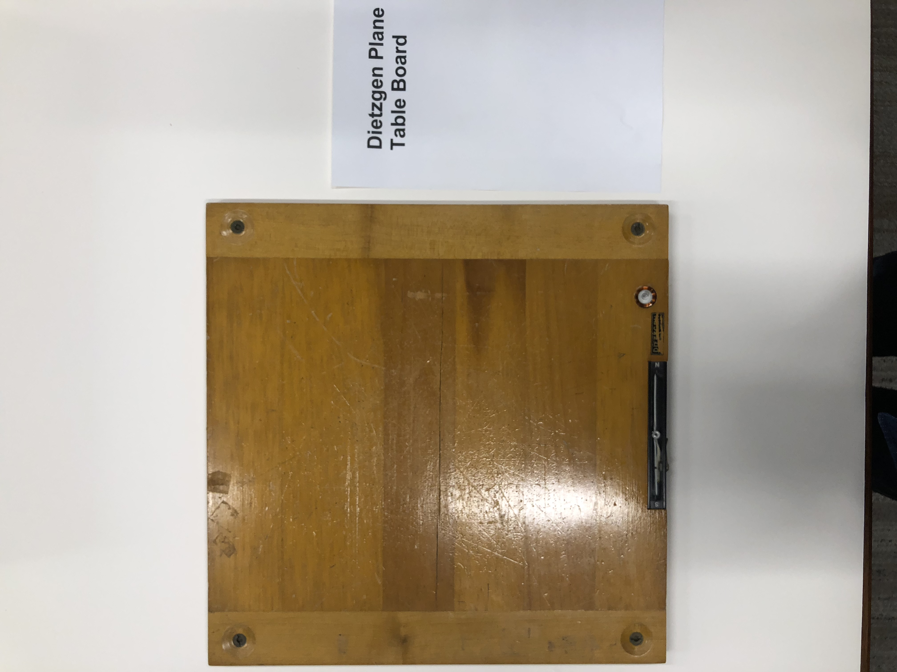
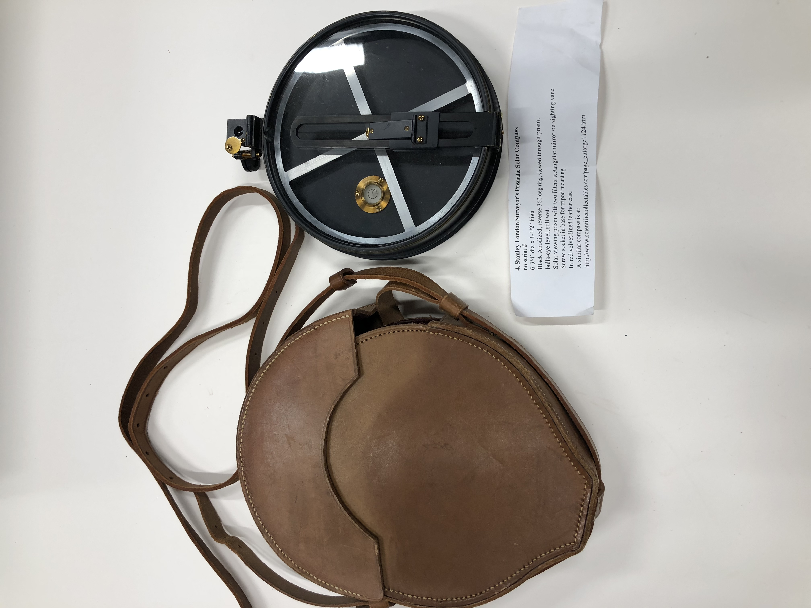
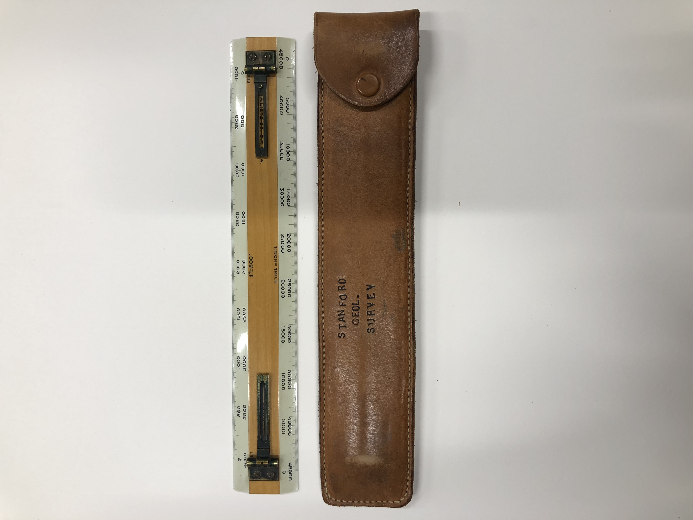
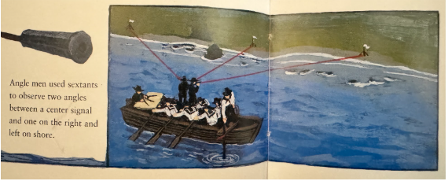
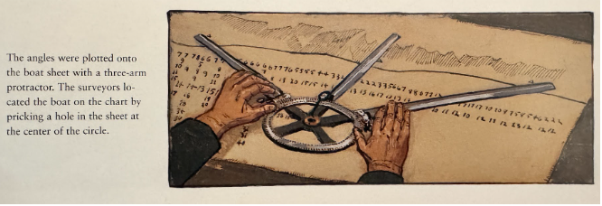

# Mapping with precision instruments
{: .no_toc }

1. TOC
{:toc}

---

## Measuring ocean depths

Hydrography, the measurement of the depths and hazards on sea floor, had been practiced for hundreds of years prior to the gold rush and depth measurements, called “soundings,” can be observed on some of the older maps in this collection. In the nineteenth century surveyors continued to capture measurements in the traditional way, using a sounding lead. What distinguishes the maps made during this period from those in use previously is the increased accuracy of the ***locations*** of the measurements.  

One method for ascertaining location involved the use of a sextant to measure the angle of the sun above the horizon. To take this measurement one must be able to see the horizon (or know where it is), a difficult prospect on a moving vessel at sea in an area characterized by dense intermittent coastal fog. Technological solutions were born to address the problem of surveyors being unable to perceive the horizon. These took several different forms. (artificial horizon, spirit-level horizon, bubble horizon). Artificial horizons were also used on land to establish the coordinates of a location when the horizon was obscured by trees, terrain, smoke, or fog. 

* George Davison’s modified sextant with spirit-level horizon 1867   
  [View on DavidRumsey.com](https://www.davidrumsey.com/luna/servlet/view/search?q=pub_list_no%3d%2216641.000%22&mi=0&qvq=sort:Pub_List_No_InitialSort%2CPub_Date%2CPub_List_No%2CSeries_No;lc:RUMSEY~8~1)

|  | |
| ----- | ----- |
| [Black Glass Artificial Horizon](https://searchworks.stanford.edu/view/11894775) | [Davis Instruments Artificial Horizon](https://www.davisinstruments.com/products/artificial-horizon?srsltid=AfmBOooT5Xn-S5-wnIXkvkJwiE8PQbQhasgbbhYAobS9rPO3dqssC2ug) (on order) |

## Geodetic  triangulation
The quality of the maps produced by the Coast Survey depended on an underlying system of accurate geodetic control networks. Surveyors first measured precise base lines on flat terrain using very long poles engineered to extrememly exact lengths. From these base lines, a network of primary and secondary triangles was extended across the coastal topography. Survey teams worked from prominent high points, peaks, and bluffs, utilizing precision direction theodolites to measure horizontal and vertical angles between stations. To ensure the durability of the network, stations were permanently anchored using survey marks

**Tools needed for triangulation**

* Baseline 
* Theodolites 
* Signal poles or small towers with flags as "stations," visual targets for surveyors
* Survey markers, or "benchmarks" for permanently preserving these locations  

[Survey Marker, 1900](<images/surveymarker.png>)
U.S.Coast and Geodetic Survey Benchmark, c1900
[View on Searchworks](https://searchworks.stanford.edu/view/11894851)

## Describing terrain or topography
Once the geodetic framework was secured, topographic details were captured in the field primarily using the plane table. Topographers set up these portable drafting boards directly on the terrain, using an alidade to sight prominent features, trace shorelines, outline coastal bluffs, and sketch contour intervals. This field data was compiled into highly detailed land-survey maps known as topographic sheets, or "T-sheets."

**Tools needed to complete a traverse, or topographical sketch:**

* [Plane table](https://searchworks.stanford.edu/view/11892835)  
* [Drawing tool set](https://searchworks.stanford.edu/view/11892834)  
* [Compass](https://searchworks.stanford.edu/view/11892860) to keep the paper oriented to the north  
* Stadia rod (held by a "rod man")  
* [Alidade](https://searchworks.stanford.edu/view/11893423) 

Dietzgen plane table board, 1950  
[View in Searchworks](https://searchworks.stanford.edu/view/11892835)  

Stanley London Surveyor’s Prismatic Solar Compass, 1910
[View in Searchworks](https://searchworks.stanford.edu/view/11892860) 

Lietz Alidade Ruler and leather case, 1900
[View in Searchworks](https://searchworks.stanford.edu/view/11893423) 

## Coastal hydrography

Teams working in small boats moving along the coast found precise sounding locations by using a pair of sextants turned horizontally (on their sides) to measure the angles between locations in the geodetic network that had been established on shore: one shared center point, or station, and additional stations located to the right and left. A three-arm protractor (or “station pointer”) was used to plot these angles onto the sketch map. A sounding lead attached to a long rope with small cloth flags at regular invervals was pitched overboard and lowered to the ocean floor. Depth measurements were established by "reading" the cloth flags and recorded on the drawing at the boat’s calculated location found at the center of the protractor.

|  |  |

*Detail images from* Morrison, Taylor “The Coastal Mappers” 

[View in Searchworks](https://searchworks.stanford.edu/view/10179705) 

**Tools needed for coastal hydrography:**

* Drawing board and [drawing tool set](https://searchworks.stanford.edu/view/11892834)  
* [Sounding lead](https://searchworks.stanford.edu/view/in00000128841) to measure depth  
* Two sextants to locate position of the ship (without artificial horizon attachments)  
* 3-arm protractor (or [station pointer](https://drive.google.com/file/d/1HvdQWU-_sfgg37cI4K9146DjbxKyu4kG/view?usp=drive_link)) to record on paper [[View at Royal Museums Greenwich]](https://www.rmg.co.uk/collections/objects/rmgc-object-42845)

 
Pocket drawing instrument set c. 1790 | [View in Searchworks](https://searchworks.stanford.edu/view/11892834) 

 
Sounding lead and line c.1900n | [View in Searchworks](https://searchworks.stanford.edu/view/in00000128841)

---